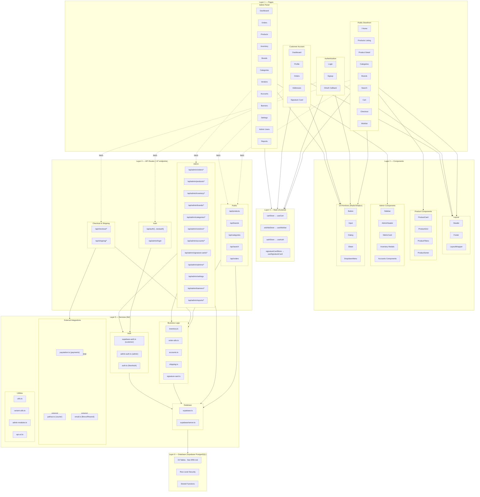

# Aline Mart — Module Relationship Diagram

> Architecture overview showing how all layers connect. Rendered with Mermaid `graph TD`.



## Layer Summary

| Layer | Description | Key Technologies |
|-------|-------------|-----------------|
| **Pages** | Next.js 16 App Router (RSC + Client) | React 19, TypeScript |
| **Components** | Reusable UI building blocks | Tailwind CSS 4, Radix UI, Shadcn |
| **State** | Client-side state with persistence | Zustand + localStorage |
| **API Routes** | ~67 REST endpoints | Next.js Route Handlers |
| **Services** | Business logic + integrations | Supabase JS, NextAuth, PayStation, Pathao, Brevo |
| **Database** | PostgreSQL with RLS | Supabase (hosted) |

## Data Flow

```
Browser → Pages (RSC/Client) → API Routes → Services → Supabase PostgreSQL
                ↕                                ↕
          Zustand Stores              External APIs (PayStation, Pathao, Brevo)
```
